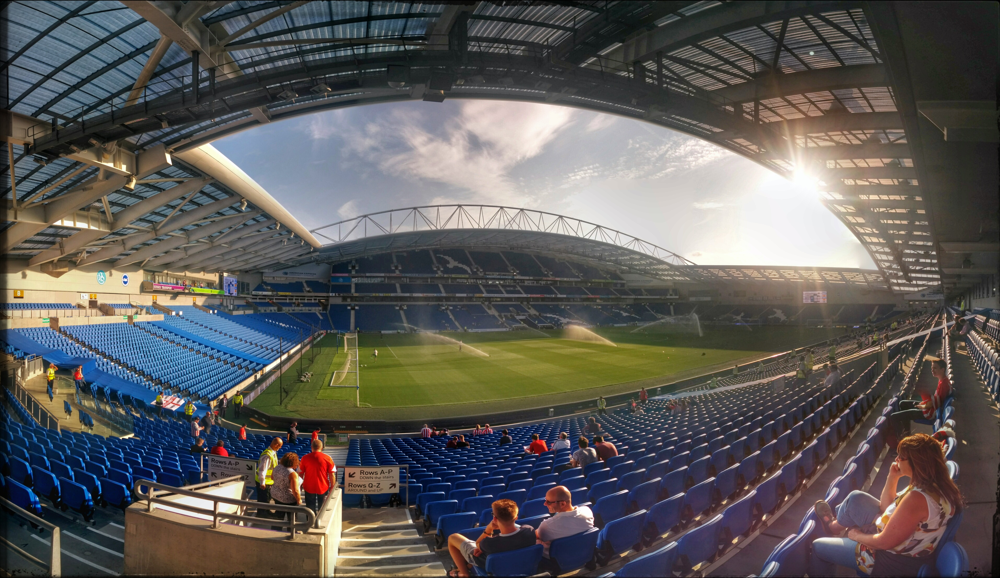

# Brighton & Hove AFC v Southampton
- Jason Deabill
- incongruousm
- 2014-08-01
- Football
- published 

_Meltdown_, _Crisis_, _Fire Sale_. All these have been used to describe the changes at Southampton recently and it was a very different side that step out into the evening sunshine of the south coast on last evening. _Lambert_, _Lallana_, _Lovren_, _Shaw_ and _Chambers_, first team regulars at the end of last season gone and a rebuilding project far from completed Southampton are undeniably under pressure as the threat of an opening day at Liverpool looms ever closer. A club diminished, thrown straight in against the very players they once called their own.

As we approached the Amex Stadium turnstiles we were approached immediately by a journalist keen to hear our opinions on the changes in our beloved club. Keen to fuel the smoldering anger amongst many fans and some players I'm sure. After excelling last season and a turmultuous summer break-up Southampton start under more scrutiny than ever before.

Yet the side that stepped out for Southampton was surprisingly strong. Saints strength is still in the midfield, _Davis_, _Ward-Prowse_, _Tadic_, _Wanyama_ and _Isgrove_ will overcome a good number of teams this season and whilst a little depth is lacking there are still _Cork_ and _Schneiderlin_ (for now) to bolster that unit.

The stats will tell you defence is also in good shape. One goal conceded in pre-season so far. However, that would overlook the relatively low quality of the opposition so far. Leverkusen should prove a sterner test. A right back and at least one centre half is required if defence is not to be our weakness this season. I like _Yoshida_, but he's backup at best, he's not a first choice centre.

And so to the strikers. With _Rodriguez_ still injured we're very thin up front. The triumvirate from last season is broken apart and we've not yet rebuilt it. Someone to challenge _Rodriguez_ is the least that's required.

Right now, Saints look good but impotent. Without further strengthening a tight season will probably see us stay up. Just. But to meet last season's top half finish I believe we need at least 4 more players. Right back, centre half, striker and a keeper that can genuinely challenge Boruc.