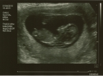
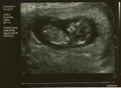
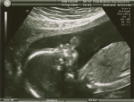
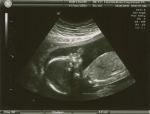
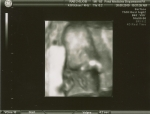

# Our 20 Week "Anomoly" Scan
- Jason Deabill
- incongruousm
- 2010-05-26
- Family
- published

At 10 this morning Katie and I visited the Fetal Medicine consultant for our 20 week “anomoly” scan. He spent a good deal of time looking around the heart and other important organs and we’re both delighted (and relieved) to say everything looks fine. :-)

Obviously, there are things that ultrasound can’t show you but this is excellent (if not terribly suprising) news. So time to relax and look forward!

Below are all the pics from this and from our 12 week scan.

   
   
   
   
   

